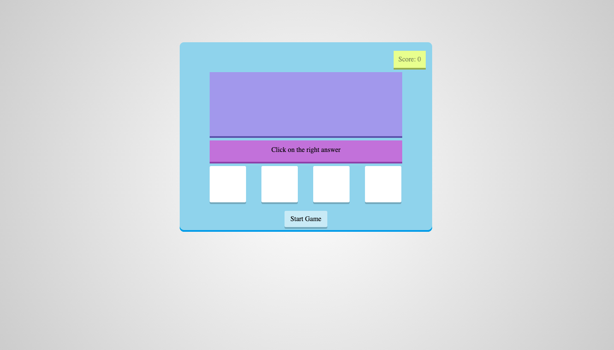
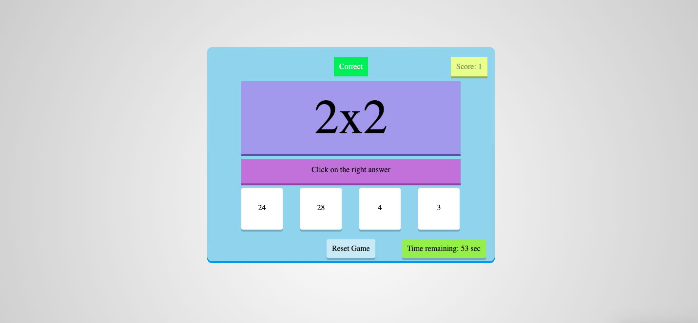
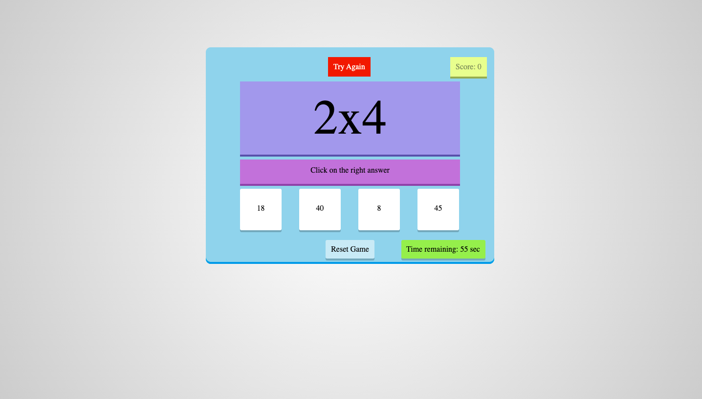
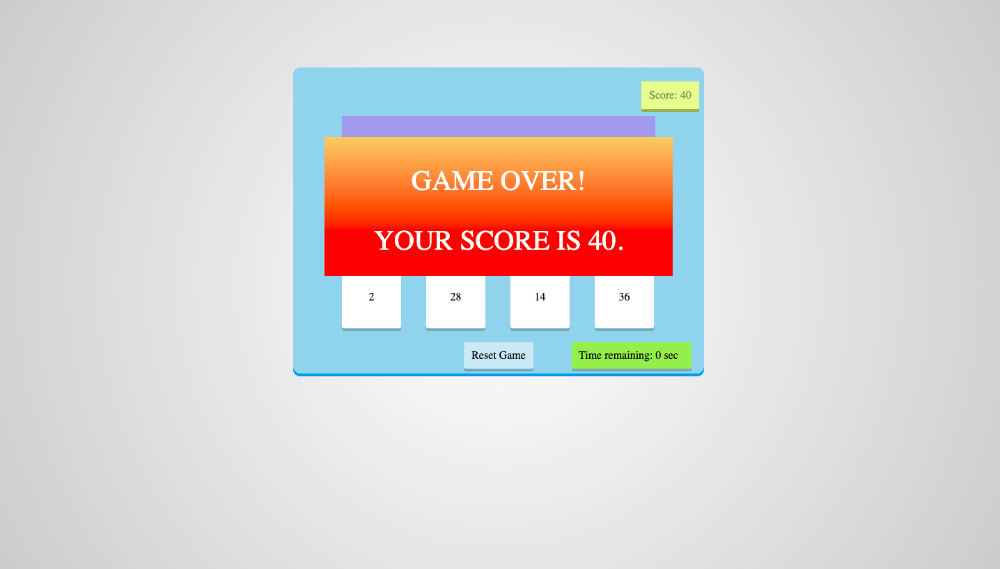

# Math Game
> Simple Math Game created with JavaScript. To start the game you have to click on "Start Game". The games starts and you have 60 seconds to gain the points. Then you have to choose correct answer for multiplication problem. If you choose correct answer then you get one point and game change the question. If you choose wrong answer then you have to try again till you choose corect answer. Game ends when time runs out. Good luck!

## Table of contents
- [Math Game](#math-game)
  - [Table of contents](#table-of-contents)
  - [Try it](#try-it)
  - [Screenshots](#screenshots)
  - [Technologies](#technologies)
  - [Features](#features)
  - [Status](#status)
  - [Inspiration](#inspiration)
  - [Contact](#contact)

## [Try it](https://hacia.students.wmi.amu.edu.pl/projects/2.math_game/index.html)

## Screenshots

Start

Correct answer

Wrong answer

Game over

## Technologies
* JavaScript 
* CSS

## Features
* Check your math skills
* Points counter
* Checking answer
* Time limited

## Status
Project is: _completed_

## Inspiration
I wanted to learn some basic JavaScript. And I like math, so I decided to make that app.

## Contact
Created by [@HondaPL](https://hacia.students.wmi.amu.edu.pl/) 2020

